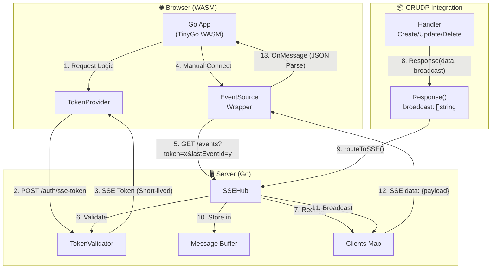
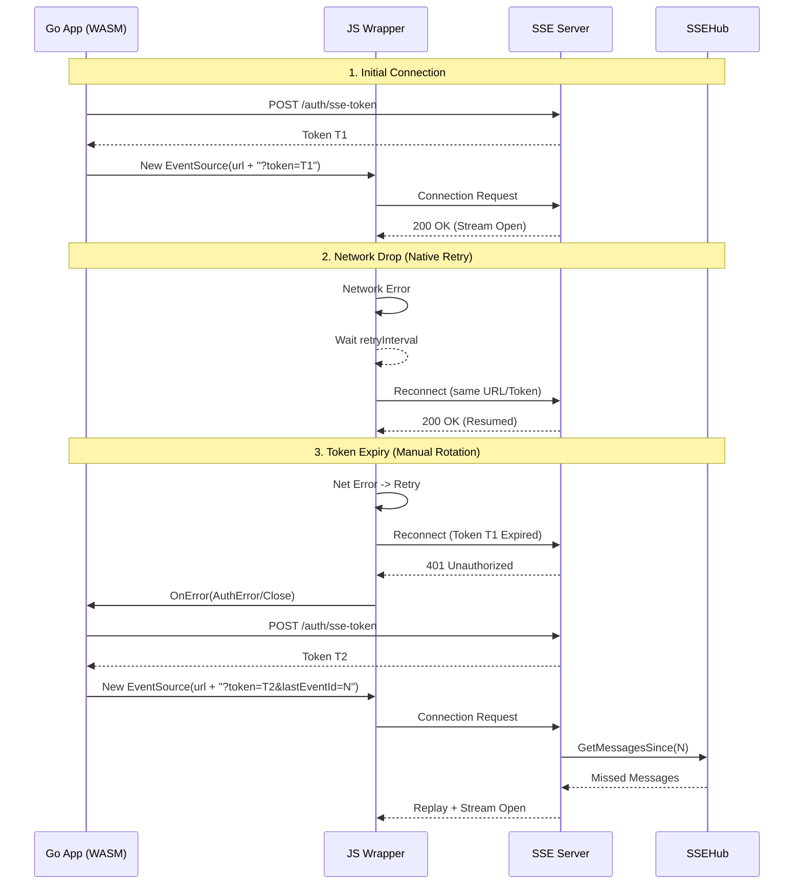
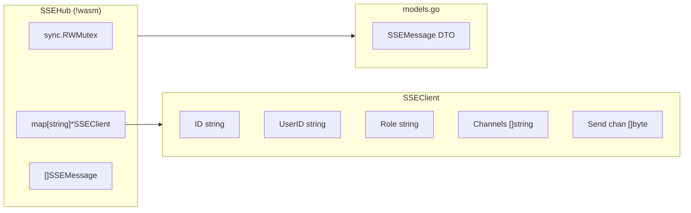
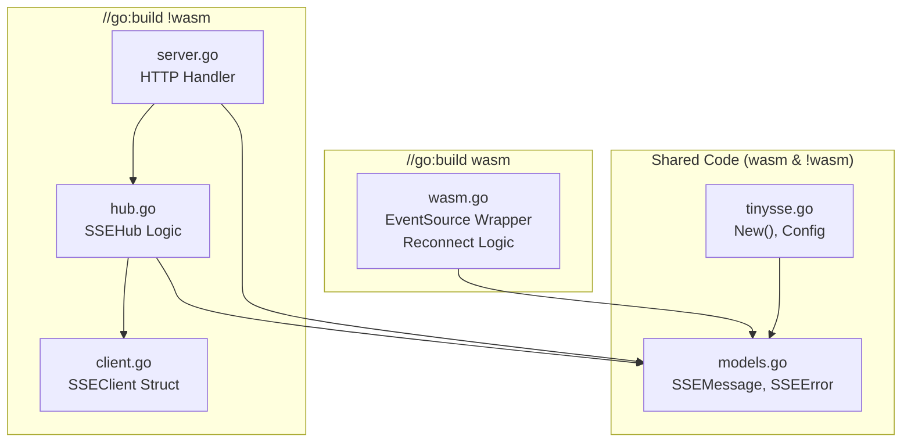

# TinySSE Architecture

> **Package:** `github.com/cdvelop/tinysse`

## System Overview

## Connection Flow (Hybrid Reconnection)

## Hub Architecture (Server-Only)

## File Structure & Build Constraints

## Key Design Decisions

| Aspect | Decision | Reason |
|--------|----------|--------|
| **Hub Location** | **Server-Only** | Reduce WASM binary size. Client is single-connection. |
| **Data Structure** | Map + Mutex | Fast lookup by ID in server. |
| **Reconnection** | **Hybrid** | Native for network glitches, Manual for token rotation. |
| **Protocol** | SSE Standard | `data: ...\n\n` required for browser compatibility. |
| **Auth** | Query Token | Compatible with EventSource API. |
| **Errors** | MessageType | Reuse properties of `tinystring.MessageType`. |

---

[← Back to Implementation Plan](./SSE_IMPLEMENTATION.md)
